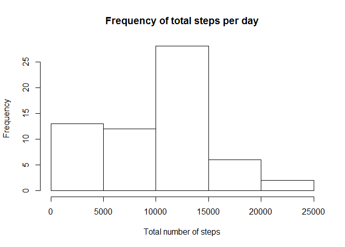
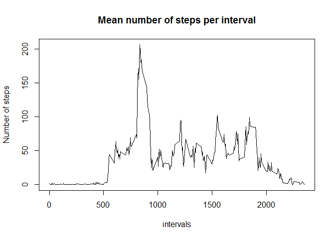
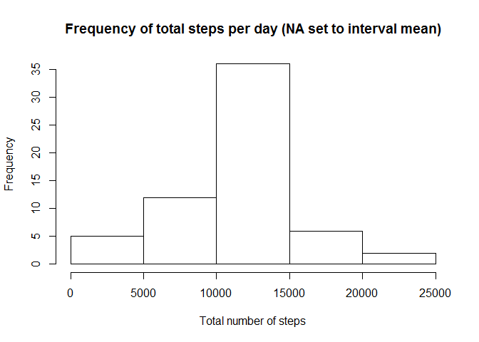
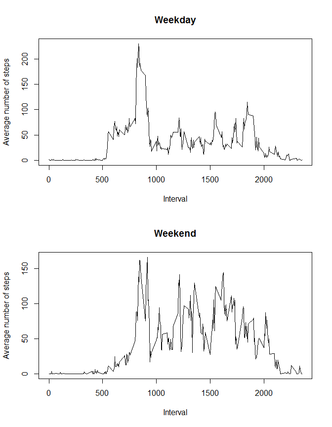

# Reproducible Research: Peer Assessment 1


## Loading and preprocessing the data
To begin the assignment, the data must be loaded into a data frame, which we call *data* with the following code.


```r
data<-read.csv("activity.csv")
```
.

## What is mean total number of steps taken per day?

To determine the total number of steps taken per day, it is useful to separate out all the unique days in the data set, this has been done and the unique days saved to the vector *days*, as follows:


```r
days<-as.vector(unique(data$date))
```

Now in order to find the total number of steps per day, a vector named *total* is initialize:


```r
total<-vector(length=length(days))
```

and then the total number of steps taken per day are determined by the following code:


```r
  for (i in 1:length(days)){
    total[i]<-sum(data[data$date==days[i],1],na.rm=TRUE)
  }
```
.

Here, the missing values have been removed from the data set with the command *na.rm=TRUE*.  A histogram of this data can then be created using the *base* plotting system, with the following code.


```r
hist(total,xlab="Total number of steps",main="Frequency of total steps per day")
```

 

The mean and median values of the total number of steps taken per day, can be calculated with the code below.


```r
totmean<-mean(total)
totmedian<-median(total)
```

This yields a value of the mean number of steps being: 9354.2295082, and the median number being: 10395.

## What is the average daily activity pattern?

Next, we can determine the average daily activity pattern for each of the five minute intervals.  To do so, we begin by creating a vector called *intervals* of all the unique intervals in the data.


```r
intervals<-as.vector(unique(data$interval))
```

We then initialize a vector named *meanint* which has a length equal to the number of unique intervals in the data.  


```r
meanint<-vector(length=length(intervals))
```

We now calculate the mean number of steps for each interval, using all the data except those with *NA* values.


```r
for (i in 1:length(intervals)){
    meanint[i]<-mean(data[data$interval==intervals[i],1],na.rm=TRUE)
}
```

With the mean number of steps for each interval calculated, we can now plot the data with the *base* plotting package.


```r
plot(intervals,meanint,type="l",ylab="Number of steps",main="Mean number of steps per interval")
```

 

We can also determine the interval with the maximum average number of steps with the *max* function, and here we set the value equal to *maxint*.


```r
maxint<-intervals[meanint==max(meanint)]
```

We find that the interval with the maximum average number of steps is: 835.

## Imputing missing values
Up until this point, we have been ignoring the *NA* values.  We can determine how many total data points we have ignored with the following code.


```r
totna<-sum(is.na(data[,1]))
```

With this code, we find that we have thrown away a total of 2304 data points.  In an attempt to not throw away all these data points, we have decided to to replace the *NA* value with the previously determined mean number of steps value for the corresponding interval.  To do this, we begin by creating a new data frame which we call *datanona* which will not contain *NA* values in the future.


```r
datanona<-data
```

Next, we will want to determine which interval each of the *NA* data points corresponds to, so that we can later use the already determined mean for this data.  We set these intervals into a vector named *nainter*.


```r
nainter<-data[is.na(data$steps),3]
```

Next we initialize a vector named *replace* which will be used to save each of the mean values for the intervals saved in *nainter*, and we fill the values of *replace* in with the following code.


```r
replace<-vector(length=length(data[is.na(data$steps),1]))
  for (i in 1:length(nainter)){
    replace[i]<-meanint[nainter[i]==intervals]
  }
```

Now we can replace the *NA* values in datanona with the following line of code.


```r
datanona[is.na(data$steps),1]<-replace
```

Now, we can calculate a new mean total number of steps taken per day which we will call *totnona*, with our new data frame which assumes all missing data values are equal to the mean number of steps for their corresponding interval.


```r
  totalnona<-vector(length=length(days))
  for (i in 1:length(days)){
    totalnona[i]<-sum(datanona[data$date==days[i],1])
  }
```

We can now re-plot the histogram plotted in Section 2 of this report (What is the mean total number of steps taken per day?), with our new data frame *datanona* which no longer ignores the *NA* values.  This plot can be made as follows.


```r
hist(totalnona,xlab="Total number of steps",main="Frequency of total steps per day (NA set to interval mean)")
```

 

We can also calculate the mean and median values for the *datanona* data frame.


```r
totmeannona<-mean(totalnona)
totmediannona<-median(totalnona)
```

Which yields a mean of: 1.0766189\times 10^{4}, and a median of: 1.0766189\times 10^{4}.  Here, we see that both the mean and the median have increased from our previous findings when the *NA* values were simply removed instead of replaced.  By replacing the *NA* values it makes it seem as though the participant has taken more steps on average than they may have in reality.

## Are there differences in activity patterns between weekdays and weekends?

One interesting question is whether there are differences in activity patterns between weekdays and weekends.  We have attempted to address this point.  To start we want to set the date information into a more useful form than the current character type.  To do so, we utilized the *lubridate* package.  The following chunk of code initializes the *lubridate* packages, and then transforms the dates in the *datanona* data frame.


```r
library(lubridate)
datanona$date<-ymd(data$date)
```

Next we added a new column to the data frame, named *day* which will be set equal to "weekday" or "weekend".  In order to do this, we utilized the *wday()* function in *lubridate* as seen below.


```r
datanona$day<-ifelse(wday(datanona$date)==1 | wday(datanona$date)==7,"weekend","weekday")
```

To determine the mean number of steps taken for each interval, on weekdays and on weekends, we created two vectors *meanintwday* and *meanintwend* which we then calculate.


```r
meanintwend<-vector(length=length(intervals))
meanintwday<-vector(length=length(intervals))
for (i in 1:length(intervals)){
  meanintwend[i]<-mean(datanona[datanona$interval==intervals[i] & datanona$day=="weekend",1])
  meanintwday[i]<-mean(datanona[datanona$interval==intervals[i] & datanona$day=="weekday",1])
  }
```

We then plot the mean number of steps per interval for both weekdays and weekends as seen below, using the *base* plotting system.


```r
par(mfrow=c(2,1))
plot(intervals,meanintwday,type="l",xlab="Interval",ylab="Average number of steps",main="Weekday")
plot(intervals,meanintwend,type="l",xlab="Interval",ylab="Average number of steps",main="Weekend")
```

 
